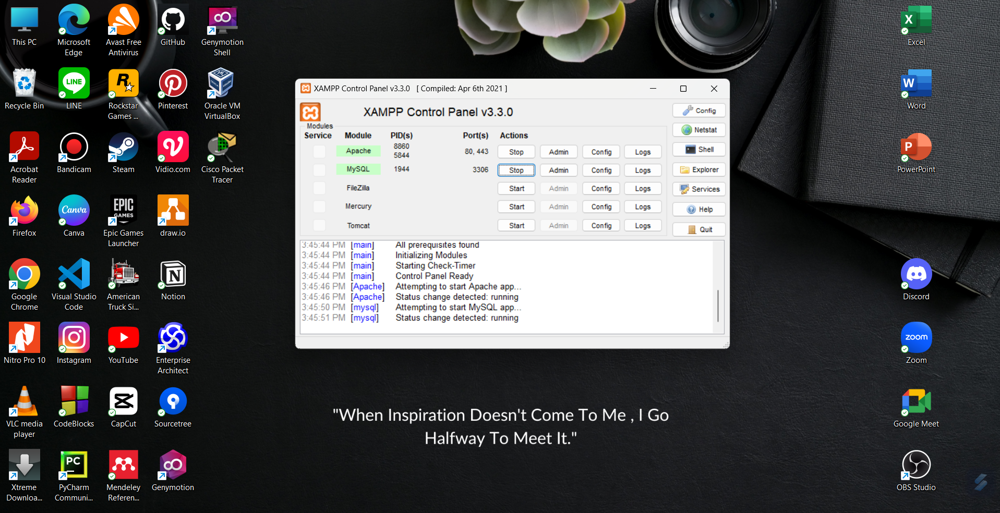
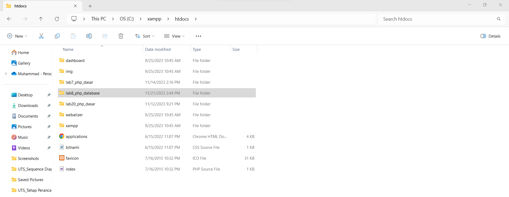

# Tugas Praktikum { Pertemuan ke 10 } 

|**Nama**|**NIM**|**Kelas**|**Matkul**|
|----|---|-----|------|
|Muhammad Ikhsan Fakhrudin|312210019|TI.22.A.2|Pemrograman Web 1|

# PHP Database

## Langkah-Langkah Praktikum

## 1. Menjalankan MySQL Server

Menjalankan MySQL dari menu **XAMPP Control.**

### Mengakses MySQL Client menggunakan 'phpmyadmin'.

Pastikan webserver Apache dan MySQL server sudah dijalankan. Kemudian untuk mengakses direktory tersebut pada web server dengan mengakses URL : http://localhost/phpmyadmin/

## 2. Membuat Database : Studi Kasus Data Barang

### Membuat Database

### Menambahkan Data

***Output Ketika Berhasil :***

## 3. Membuat Program CRUD

Buat folder ``lab8_php_database`` pada root directory web server , misal ***(C:/xampp/htdocs).***

Kemudian untuk mengakses direktory tersebut pada web server dengan mengakses URL: http://localhost/lab8_php_database/

## Masih belum selesai , saya lagi cari cara agar 'MySQL XAMPP' dan 'MySQL Workbench' agar tidak bentrok.